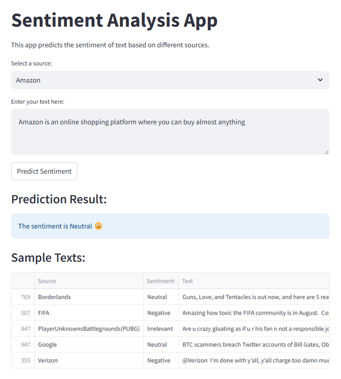

# Sentiment Analysis Project

This project implements a sentiment analysis application using machine learning & NLP and provides a user interface with Streamlit.


## Setup

1. Clone this repository.
2. Install the required packages:
   ```
   pip install -r requirements.txt
   ```
3. Place your `twitter_training.csv` and `twitter_validation.csv` files in the `data/` directory.

## Usage

1. Train the models:
   ```
   python src/sentiment_analysis.ipynb
   ```
2. Run the Streamlit app:
   ```
   streamlit run app.py
   ```
3. Open your web browser and go to the URL provided by Streamlit (usually `http://localhost:8501`).

## Project Structure

- `data/`: Contains the training and validation datasets.
- `src/`: Contains the source code for model training and prediction.
- `models/`: Stores the trained models and vectorizers.
- `app.py`: The main Streamlit application.
- `requirements.txt`: List of Python dependencies.



